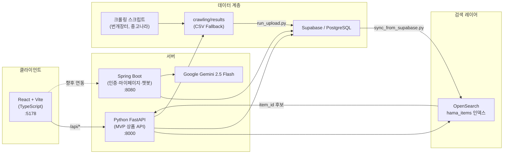

# Hama — 개인 포트폴리오

> **정지원** | 팀장 · 백엔드 & DB 설계 · 데이터 파이프라인  
> KDT 4기 팀 프로젝트 **사육사조** | 2026.03.16 ~ 2026.06

| 문서 | 링크 |
|------|------|
| **Hama 작업 폴더** | [../README.md](../README.md) |
| **ERD** | [ERD.drawio.png](./ERD.drawio.png) |

**프로젝트 저장소:** [github.com/jiwon-jung323/kdtproject](https://github.com/jiwon-jung323/kdtproject)  
**팀 조직:** [github.com/shortKDT](https://github.com/shortKDT)  
**포트폴리오 위치:** `teamproject/hama/docs/portfolio_jiwon.md` (본 저장소)

> 아래 코드·문서 링크는 팀 프로젝트 저장소 `main` 브랜치 기준입니다.

---

## 프로필

| 항목 | 내용 |
|------|------|
| **이름** | 정지원 |
| **소속** | KDT 4기 · 팀 **사육사조** |
| **역할** | 팀장, 백엔드 & DB 설계, GitHub 레포 관리, 데이터 파이프라인 |
| **GitHub** | https://github.com/jiwon-jung323 |
| **이메일** | jewjiwon0323@daum.net |
| **기술 스택** | Python, FastAPI, Spring Boot, Java 21, PostgreSQL(Supabase), OpenSearch, pandas, scikit-learn, Jupyter, Git |

**한 줄 소개**

> 여러 중고거래 플랫폼의 상품 데이터를 수집·정제·적재하는 파이프라인을 설계하고, DB 스키마와 FastAPI MVP API를 구축해 통합 검색·가격 비교 서비스의 백엔드 기반을 마련했습니다.

---

## 프로젝트 개요

**Hama(하마)** 는 번개장터, 중고나라 등 중고거래 플랫폼의 상품 데이터를 통합 수집·정제하여, 한 화면에서 **검색, 가격 비교, 가격 추이, 찜, 추천**을 제공하는 웹 서비스입니다.

| 항목 | 내용 |
|------|------|
| **기간** | 2026.03.16 ~ 2026.06 |
| **팀** | 사육사조 (4인) |
| **형태** | 웹 애플리케이션 (로컬 MVP + EC2 배포 스크립트) |
| **프로젝트 GitHub** | https://github.com/jiwon-jung323/kdtproject |
| **팀 GitHub** | https://github.com/shortKDT |
| **Notion** | https://suave-kip-fd7.notion.site/KDT-350c2695cef080ec881ad5a86bdd8da8 |

### 팀 구성

| 이름 | 역할 | GitHub |
|------|------|--------|
| **정지원** (본인) | 팀장, 백엔드 & DB 설계, 레포 관리, 데이터 파이프라인 | https://github.com/jiwon-jung323 |
| 정우진 | PM, 데이터 수집 파이프라인, 프론트 구조·UI | https://github.com/rainstorm0907 |
| 김다은 | 프론트엔드, 홈·공통 컴포넌트 | https://github.com/rlekdm |
| 이준호 | 백엔드, AI 챗봇 | https://github.com/dlwnsgh1130 |

---

## 요구사항 및 문제 정의

### 배경

중고거래는 플랫폼마다 가격·상품명 표기가 달라, 동일 상품을 비교하려면 여러 앱을 오가야 합니다. 또한 번개장터 API는 검색어와 느슨하게 매칭된 후보를 많이 반환해 **오탐 상품이 가격 통계를 왜곡**합니다.

| 문제 | 구체적 사례 |
|------|------------|
| 플랫폼 분산 | 번개장터·중고나라를 각각 검색해야 함 |
| 검색 오탐 | `갤럭시 s26` 검색 시 `갤럭시S24`, `s23FE` 등 다른 모델 포함 |
| 액세서리 혼입 | 케이스·필름·맥세이프 상품이 본체 가격 통계에 섞임 |
| 모델명 파싱 한계 | `아이폰 17e`가 `17`+`e`로 분리되어 오매칭 |
| 가격 이상치 | 키워드별 이상치 비율 최대 40%+(예: 골드바 40.7%) |

### 핵심 요구사항

| ID | 요구사항 | 우선순위 |
|----|----------|----------|
| FR-01 | 멀티 플랫폼 상품 통합 검색 (키워드, 플랫폼 필터, 정렬, 페이지네이션) | 필수 |
| FR-02 | 표준 상품명(`canonical_name`) 기반 가격 통계·시세 추이 | 필수 |
| FR-03 | 크롤링 데이터 정합성 검증 및 이상치 필터링 | 필수 |
| FR-04 | 찜, 최근 본 상품, 알림, 가격 비교 | 중요 |
| FR-05 | 회원가입·로그인·마이페이지 | 중요 |
| FR-06 | AI 챗봇 기반 상품 상담·추천 | 선택 |
| FR-07 | 관리자 대시보드 (KPI, 이상 데이터 모니터링) | 선택 |

**관련 문서:** [requirements.md](https://github.com/jiwon-jung323/kdtproject/blob/main/docs/requirements.md) · [search_relevance_plan.md](https://github.com/jiwon-jung323/kdtproject/blob/main/docs/search_relevance_plan.md) · [Notion KDT 프로젝트](https://suave-kip-fd7.notion.site/KDT-350c2695cef080ec881ad5a86bdd8da8)

---

## 담당 역할 및 기여

### 1. 프로젝트 리딩 & 인프라

- 프로젝트 초기 **폴더 구조·스캐폴딩** 설계 ([`code/backend`](https://github.com/jiwon-jung323/kdtproject/tree/main/code/backend), [`code/frontend`](https://github.com/jiwon-jung323/kdtproject/tree/main/code/frontend), [`docs/`](https://github.com/jiwon-jung323/kdtproject/tree/main/docs))
- **GitHub 레포지토리 관리** — 팀원 PR 리뷰·머지, shortKDT 조직 레포 연동
- [README.md](https://github.com/jiwon-jung323/kdtproject/blob/main/README.md), `.gitignore`, 실행 가이드, 팀 역할 정의 작성
- 요구사항·구현 체크리스트·갭 리포트 등 **문서 체계** 수립 ([document_checklist.md](https://github.com/jiwon-jung323/kdtproject/blob/main/docs/document_checklist.md), [implementation_gap_report.md](https://github.com/jiwon-jung323/kdtproject/blob/main/docs/implementation_gap_report.md))
- **배포 스크립트 연동** — 팀원(정우진)이 작성한 EC2 bootstrap·systemd·nginx 예시와 Python 파이프라인·Supabase 적재 흐름 정합 ([ec2_bootstrap.sh](https://github.com/jiwon-jung323/kdtproject/blob/main/code/backend/deploy/ec2_bootstrap.sh))

### 2. DB 설계 & 스키마 관리

- **16개+ 테이블** ERD 설계 (사용자, 상품, 시세, 찜, 알림, 검색 로그, 챗봇 등) — [ERD.drawio.png](./ERD.drawio.png) · [kdtproject 원본](https://github.com/jiwon-jung323/kdtproject/blob/main/docs/ERD.drawio.png)
- Oracle 기준 설계안([db_schema.sql](https://github.com/jiwon-jung323/kdtproject/blob/main/docs/db_schema.sql)) → Supabase/PostgreSQL 운영 스키마([supabase_schema.sql](https://github.com/jiwon-jung323/kdtproject/blob/main/docs/supabase_schema.sql)) 전환
- **DB 스키마 설계 주도** — ERD·Oracle 설계안·Supabase 문서화, migration 6건 중 **2건 직접 작성** + 나머지 팀 협업
  - **본인 직접 작성**
    - [20260608120000_add_items_rating.sql](https://github.com/jiwon-jung323/kdtproject/blob/main/code/supabase/migrations/20260608120000_add_items_rating.sql) — 상품 rating 컬럼
    - [20260609120000_merge_platforms_into_items.sql](https://github.com/jiwon-jung323/kdtproject/blob/main/code/supabase/migrations/20260609120000_merge_platforms_into_items.sql) — platforms → items 통합
  - **팀 협업 (설계·리뷰·문서 동기화)**
    - [20260519000000_hama_schema.sql](https://github.com/jiwon-jung323/kdtproject/blob/main/code/supabase/migrations/20260519000000_hama_schema.sql) — 핵심 스키마 (정우진 polish + 본인 sql_update)
    - [20260608000000_service_search_schema.sql](https://github.com/jiwon-jung323/kdtproject/blob/main/code/supabase/migrations/20260608000000_service_search_schema.sql) — search_events 등 (정우진, OpenSearch 연동)
    - [20260611120000_align_user_domain_tables_to_spring_schema.sql](https://github.com/jiwon-jung323/kdtproject/blob/main/code/supabase/migrations/20260611120000_align_user_domain_tables_to_spring_schema.sql) — Spring JPA user 도메인 정합 (정우진)
    - [20260611130000_add_role_column_to_users.sql](https://github.com/jiwon-jung323/kdtproject/blob/main/code/supabase/migrations/20260611130000_add_role_column_to_users.sql) — users.role (정우진)
- [db_column_catalog.md](https://github.com/jiwon-jung323/kdtproject/blob/main/docs/db_column_catalog.md), [supabase_setup.md](https://github.com/jiwon-jung323/kdtproject/blob/main/docs/supabase_setup.md), ERD 자동 생성 도구([generate_supabase_erd.py](https://github.com/jiwon-jung323/kdtproject/blob/main/code/backend/src/main/python/tools/generate_supabase_erd.py)) 작성

### 3. 크롤링 & 데이터 수집

- **번개장터 API / 중고나라** 크롤링 스크립트 개발 ([run_crawling.py](https://github.com/jiwon-jung323/kdtproject/blob/main/code/backend/src/main/python/run_crawling.py))
- 필터 적용·미적용 버전 분리로 **오탐률 정량 비교** (5,515건 → 8,078건, 차이 2,563건)
- [keyword_list.csv](https://github.com/jiwon-jung323/kdtproject/blob/main/code/backend/src/main/python/crawling/keyword_list.csv) 표준 상품명 관리, [blacklist_keywords/tokens.csv](https://github.com/jiwon-jung323/kdtproject/tree/main/code/backend/src/main/python/crawling) 노이즈 필터 목록 운영
- [lib/crawling_pipeline.py](https://github.com/jiwon-jung323/kdtproject/blob/main/code/backend/src/main/python/lib/crawling_pipeline.py) — 크롤링 파이프라인 모듈화

### 4. 데이터 전처리 & 분석 파이프라인 (핵심 기술 기여)

**문제:** 번개장터 API가 검색어와 느슨하게 매칭된 후보를 반환해, 오탐 상품이 `canonical_name` 기준 가격 통계를 왜곡함.

**해결:** 규칙 기반 정합성 필터 + 토큰 매칭 + 가격 이상치 제거 파이프라인 구축

| 모듈 | 역할 |
|------|------|
| [lib/keyword_preprocessing.py](https://github.com/jiwon-jung323/kdtproject/blob/main/code/backend/src/main/python/lib/keyword_preprocessing.py) | `keyword_matches_title()` 정합성 필터, 가격 이상치 제거, 클러스터링 |
| [lib/hama_data_pipeline.py](https://github.com/jiwon-jung323/kdtproject/blob/main/code/backend/src/main/python/lib/hama_data_pipeline.py) | Aho-Corasick 토큰 매칭 기반 상품명 표준화 |
| [lib/product_matching.py](https://github.com/jiwon-jung323/kdtproject/blob/main/code/backend/src/main/python/lib/product_matching.py) | 상품 매칭 로직 |
| [lib/item_rating.py](https://github.com/jiwon-jung323/kdtproject/blob/main/code/backend/src/main/python/lib/item_rating.py) | 상품 rating 점수 계산 |
| [lib/keyword_final_pipeline.py](https://github.com/jiwon-jung323/kdtproject/blob/main/code/backend/src/main/python/lib/keyword_final_pipeline.py) | 노트북 분석 로직을 실행 가능한 CLI 파이프라인으로 전환 |

**설정 CSV (코드 수정 없이 매칭 규칙 운영)** — [config/README.md](https://github.com/jiwon-jung323/kdtproject/blob/main/code/backend/src/main/python/config/README.md)

| 파일 | 역할 |
|------|------|
| [product_token_dictionary.csv](https://github.com/jiwon-jung323/kdtproject/blob/main/code/backend/src/main/python/config/product_token_dictionary.csv) | 브랜드·모델·스펙·옵션 Trie 사전 |
| [category_rules.csv](https://github.com/jiwon-jung323/kdtproject/blob/main/code/backend/src/main/python/config/category_rules.csv) | 토큰 조합 → 카테고리 배정 |
| [token_exclude_list.csv](https://github.com/jiwon-jung323/kdtproject/blob/main/code/backend/src/main/python/config/token_exclude_list.csv) | 노이즈·낚시성 토큰 제외 |
| [accessory_tokens.csv](https://github.com/jiwon-jung323/kdtproject/blob/main/code/backend/src/main/python/config/accessory_tokens.csv) | 액세서리 토큰 분기 |

**분석 도구**

- [keyword_final.ipynb](https://github.com/jiwon-jung323/kdtproject/blob/main/code/backend/src/main/python/analysis/notebooks/keyword_final.ipynb) — 전처리·클러스터·rating 최종 파이프라인
- `keyword_price_outliers*.ipynb` — IQR 기반 가격 이상치 분석 (키워드별 최대 40%+ 식별)
- [check_title_keyword_accuracy.py](https://github.com/jiwon-jung323/kdtproject/blob/main/code/backend/src/main/python/analysis/scripts/check_title_keyword_accuracy.py) — 제목-키워드 정확도 검증
- [cluster_bracket_contents.py](https://github.com/jiwon-jung323/kdtproject/blob/main/code/backend/src/main/python/analysis/scripts/cluster_bracket_contents.py) — 대괄호 내용 클러스터링
- [compare_platform_data.py](https://github.com/jiwon-jung323/kdtproject/blob/main/code/backend/src/main/python/analysis/scripts/compare_platform_data.py) — 플랫폼별 데이터 비교

### 5. Python 백엔드 (FastAPI MVP)

- [api_server.py](https://github.com/jiwon-jung323/kdtproject/blob/main/code/backend/src/main/python/api_server.py) — 상품 검색·추천·상세 MVP API 확장·유지보수 (초기 API는 팀원과 공동)
- [lib/supabase_repository.py](https://github.com/jiwon-jung323/kdtproject/blob/main/code/backend/src/main/python/lib/supabase_repository.py) — **Supabase + CSV fallback** 이중 데이터 소스
- E2E 실행 스크립트 체계화 ([Python 백엔드 README](https://github.com/jiwon-jung323/kdtproject/blob/main/code/backend/src/main/python/README.md))

```text
apply_schema.py → run_crawling.py → run_refine_data.py → run_upload.py → api_server.py
                              └─ run_pipeline.py (전체 일괄 실행)
```

**FastAPI 엔드포인트 — 본인 주도 (MVP 4개)**

| Method | Path | 설명 |
|--------|------|------|
| GET | `/api/health` | 상태 확인 (`dataSource`, `searchSource`) |
| GET | `/api/products/search` | 상품 검색 (Supabase/CSV, OpenSearch 연동은 팀 확장) |
| GET | `/api/products/recommended` | 추천 상품 |
| GET | `/api/products/{platform}/{pid}` | 상품 상세 |

**팀 확장 API (정우진 주도 — 본인은 파이프라인·데이터 계약 연동)**

| Method | Path | 설명 |
|--------|------|------|
| GET | `/api/products/anomalies` | 관리자 이상데이터 |
| GET | `/api/products/anomalies/summary` | 이상데이터 카운트 |
| GET | `/api/products/{platform}/{pid}/insights` | 클러스터 기준 가격 트렌드 |
| POST | `/api/chatbot/message` | Gemini 챗봇 ([gemini_chatbot.py](https://github.com/jiwon-jung323/kdtproject/blob/main/code/backend/src/main/python/lib/gemini_chatbot.py)) |

- Supabase 미설정 환경에서도 `.env` 없이 로컬 시연 가능하도록 설계

### 6. OpenSearch 검색 레이어 (팀 협업)

대량 상품 검색 성능을 위해 **OpenSearch(검색 후보) + Supabase(기준 DB)** 2단계 구조를 팀에서 도입했습니다. **최초 구현·EC2 연동은 정우진(PM) 주도**, 본인은 Supabase 적재 파이프라인·`lib/` 리팩터링 과정에서 **데이터 색인 입력과 API 계약 정합**을 담당했습니다.

| 구성 | 역할 | 주 작성 | 링크 |
|------|------|---------|------|
| `docker-compose.yml` | 로컬 OpenSearch 서버 | 정우진 | [opensearch/](https://github.com/jiwon-jung323/kdtproject/tree/main/code/backend/opensearch) |
| `documents.py` | Supabase row → 검색 문서 변환 | 정우진 | [documents.py](https://github.com/jiwon-jung323/kdtproject/blob/main/code/backend/opensearch/documents.py) |
| `repository.py` | FastAPI 검색 요청·item_id 반환 | 정우진 | [repository.py](https://github.com/jiwon-jung323/kdtproject/blob/main/code/backend/opensearch/repository.py) |
| `sync_from_supabase.py` | DB → 인덱스 색인 배치 | 정우진 (본인 리팩터링) | [sync_from_supabase.py](https://github.com/jiwon-jung323/kdtproject/blob/main/code/backend/opensearch/sync_from_supabase.py) |

```text
사용자 검색어 → OpenSearch (item_id 후보) → Supabase (실제 상품 정보) → 프론트 응답
```

상세 설명: [OpenSearch README](https://github.com/jiwon-jung323/kdtproject/blob/main/code/backend/opensearch/README.md)

### 7. Spring Boot 백엔드 — 스키마·문서 정합 (팀장 역할)

- Spring Boot 코드 통합·리팩터링은 **이준호·정우진** 주도, 본인은 **DB 스키마·Python API 계약 정합**과 **갭 관리** 담당
- [implementation_gap_report.md](https://github.com/jiwon-jung323/kdtproject/blob/main/docs/implementation_gap_report.md) — Spring JPA(`Long` PK) vs Supabase(`UUID` PK) 불일치 진단 및 5단계 우선순위 제안
- Oracle 설계안 → Supabase 운영 스키마 문서 동기화, [db_column_catalog.md](https://github.com/jiwon-jung323/kdtproject/blob/main/docs/db_column_catalog.md) 작성
- Spring user 도메인 migration은 **정우진**이 작성·적용, 본인은 설계 의도·Python 파이프라인과의 컬럼 정합 리뷰

---

## 상품명 매칭 고민 과정

프로젝트 핵심 과제 중 하나는 **"플랫폼마다 다른 상품명을 어떻게 같은 상품으로 묶고, 오탐을 걸러낼 것인가"** 였습니다. 아래는 현재 방식에 도달하기까지의 변천 과정입니다.

### 배경

번개장터 API는 검색어와 느슨하게 연결된 상품을 많이 반환합니다. `갤럭시 s26` 검색 시 `갤럭시S24`, `s23FE` 등이 함께 들어오고, 케이스·필름 같은 액세서리도 본체 가격 통계에 섞입니다. 이 상태로 `canonical_name` 기준 시세를 집계하면 **오탐 상품이 평균가·최저가를 왜곡**합니다.

### 1단계 — 플랫폼 검색 결과 그대로 수집

- [keyword_list.csv](https://github.com/jiwon-jung323/kdtproject/blob/main/code/backend/src/main/python/crawling/keyword_list.csv) 키워드로 번개장터·중고나라 검색 후 **필터 없이** 저장
- 키워드별 개별 CSV 출력

**한계:** 번개장터 오탐 다수, 액세서리 혼입, 표기 불일치(`S25+` / `s25 plus` / `갤럭시S25플러스`), 동일 상품 중복 수집

### 2단계 — 규칙 기반 1차 필터 (`keyword_matches_title`)

크롤링 시점에 `keyword`와 상품명(`name`) 정합성을 검사하고, **필터 적용·no-filter 버전을 분리**해 비교할 수 있게 했습니다.

1. **텍스트 정규화** — `+`/`plus`→`플러스`, `pro`→`프로`, `max`→`맥스`, `ultra`→`울트라`
2. **키워드 토큰화** — `[a-z]+[0-9]+[a-z]? | [가-힣]+ | [a-z]+ | \d+`
3. **경계 매칭** — `s25`가 `s23`·`s256`에 붙으면 불일치, 키워드의 **모든 토큰**이 상품명에 있어야 통과

| 구분 | 건수 (2026-05-07) |
|------|-------------------|
| 필터 적용 | 5,515건 |
| 필터 없음 | 8,078건 |
| 차이 | **2,563건** (대부분 번개장터) |
| 중고나라 차이 | **7건** (상대적으로 안정) |

**한계:** `아이폰 17e`가 `17`+`e`로 분리되어 오매칭, 액세서리 강제 제외 불가, 여러 모델 나열 상품(`아이폰 13,14,15,16,17 프로`) 일부 통과

### 3단계 — 정합성 검증 도구 & 토큰 패턴 개선

- [check_title_keyword_accuracy.py](https://github.com/jiwon-jung323/kdtproject/blob/main/code/backend/src/main/python/analysis/scripts/check_title_keyword_accuracy.py) — 키워드별 pass/fail CSV·요약 자동 생성
- 토큰 패턴에 `[a-z]?` 접미사 추가 → `17e`, `s25fe`를 **단일 토큰**으로 처리
- [compare_platform_data.py](https://github.com/jiwon-jung323/kdtproject/blob/main/code/backend/src/main/python/analysis/scripts/compare_platform_data.py) — 번개장터 vs 중고나라 정합성 차이 정량 비교
- 향후 ML 분류 모델용 라벨 데이터셋 설계 (positive: 중고나라 필터 결과 / negative: 번개장터 no-filter 제거분)

### 4단계 — 노이즈 분석 (대괄호·블랙리스트)

상품명에 섞인 의미 없는 텍스트를 별도 분석했습니다.

| 노이즈 유형 | 예시 |
|------------|------|
| 판매자 관리번호 | `[01272]`, `[25777]` |
| 상품 상태 | `[미개봉]`, `[리퍼급]`, `[A급]` |
| 지역·매장 | `[대전 중고폰]`, `부산중고폰` |
| 액세서리 | 케이스, 필름, 맥세이프, 강화유리 |

- [cluster_bracket_contents.py](https://github.com/jiwon-jung323/kdtproject/blob/main/code/backend/src/main/python/analysis/scripts/cluster_bracket_contents.py) — `[]` 안 텍스트 추출·클러스터링으로 노이즈 후보 발굴
- [blacklist_keywords.csv](https://github.com/jiwon-jung323/kdtproject/blob/main/code/backend/src/main/python/crawling/blacklist_keywords.csv) — 상품명 전체 블랙리스트
- [blacklist_tokens.csv](https://github.com/jiwon-jung323/kdtproject/blob/main/code/backend/src/main/python/crawling/blacklist_tokens.csv) — 토큰 단위 제외 목록

> **운영 방식 선택:** AI API(Gemini 등)로 상품명·노이즈를 자동 분류하는 방안은 **팀 프로젝트 API 비용 제약**으로 채택하지 못했습니다. 대신 클러스터링·정합성 분석으로 도출한 제외 후보를 CSV·규칙에 **하드코딩**해 1차 필터로 운영했습니다.

### 5단계 — 상품명 정규화 & 토큰 클러스터링

필터를 통과해도 `갤럭시S25플러스256GB미개봉택포`처럼 붙어 있는 상품명을 같은 상품군으로 묶기 위해 `cluster_normalized_name()`을 설계했습니다.

1. `()`, `[]` 안 내용 제거
2. 거래 문구·상태·등급·색상·지역명 제거
3. 모델명 공백 합치기 (`s 25`→`s25`, `아이폰 17 프로`→`아이폰17프로`)
4. 용량 통일 (`256기가`, `256G`→`256gb`)
5. TF-IDF + AgglomerativeClustering으로 유사 상품명 묶기 → **`cluster_product_name`** 생성

### 6단계 — Aho-Corasick 토큰 사전 & 매칭 인덱스

규칙만으로는 브랜드·모델·스펙·옵션 추출이 불안정해, **CSV 설정 + 고속 매칭** 구조로 전환했습니다. ([config/README.md](https://github.com/jiwon-jung323/kdtproject/blob/main/code/backend/src/main/python/config/README.md))

| 구성요소 | 역할 |
|----------|------|
| `product_token_dictionary.csv` | 브랜드·모델·스펙·옵션 Trie 사전 (alias 포함) |
| `category_rules.csv` | 토큰 조합 → 카테고리 배정 |
| `token_exclude_list.csv` | 노이즈·낚시성 토큰 제외 |
| Aho-Corasick 오토마톤 | 수천 개 토큰을 상품명에서 O(n) 고속 매칭 |
| `ProductMatchIndex` | Jaccard 유사도 + 토큰 인덱스로 유사 상품 후보 탐색 |

### 7단계 — 본체 vs 액세서리 분기 (`cluster_route`)

`갤럭시 s25` 키워드에 케이스·필름이 섞이면 본체 시세가 왜곡되므로, 상품 유형별로 `cluster_product_name` 생성 경로를 분리했습니다.

- **canonical** — 기종 토큰 명확 시 (`keyword + 기종 + 용량`)
- **accessory** — 액세서리 토큰 감지 시 (`keyword + 기종 + 케이스/필름 등`)
- **token** — 그 외 토큰 클러스터 결과 사용

### 8단계 — 가격 이상치 필터 & rating (현재 파이프라인)

매칭은 맞아도 가격이 비정상인 경우(키워드별 이상치 최대 40%+)를 대비해 마지막 단계를 추가했습니다.

- 키워드별 IQR 기반 가격 이상치 제거
- [item_rating.py](https://github.com/jiwon-jung323/kdtproject/blob/main/code/backend/src/main/python/lib/item_rating.py) — 상품 신뢰도 점수 계산
- 제거 행은 `drop_reason`, `drop_stage`와 함께 `keyword_dropped_df.csv`에 기록
- Jupyter 노트북 분석 로직을 [run_refine_data.py](https://github.com/jiwon-jung323/kdtproject/blob/main/code/backend/src/main/python/run_refine_data.py) CLI로 전환

### 현재 확정된 매칭 체계

```text
[원본 상품명 title]
       ↓
① 텍스트 정규화 (plus→플러스, pro→프로 등)
       ↓
② keyword_matches_title() 정합성 필터 (토큰 경계 매칭)
       ↓
③ cluster_normalized_name() 노이즈 제거
       ↓
④ Aho-Corasick 토큰 사전 매칭 (brand/model/spec/option)
       ↓
⑤ 토큰 클러스터링 → cluster_product_name 생성
       ↓
⑥ 본체/액세서리 분기 (cluster_route)
       ↓
⑦ 가격 이상치 제거 + rating 계산
       ↓
⑧ DB 저장 (canonical_name, cluster_product_name, title 분리)
```

| 필드 | 역할 |
|------|------|
| `keyword` | 크롤링 검색어 (표준 상품명 후보) |
| `canonical_name` | 중복 제거 시 가장 구체적인 키워드 |
| `cluster_product_name` | **가격 집계 기준** 표준 상품명 |
| `title` | 플랫폼 원본 상품명 (그대로 보존) |
| `matched_keywords` | 같은 상품에 매칭된 키워드 목록 |

### 향후 개선 방향

- 규칙 필터 + no-filter 결과로 **라벨 데이터셋** 구축
- scikit-learn 기반 **1차 분류 모델** (Logistic Regression, RandomForest) — API 비용 없이 규칙 필터 보완
- API 예산·비용 대비 효과를 검토한 뒤 LLM 보조 매칭 등 **AI API 단계적 도입**
- `rapidfuzz` 유사도, SBERT 임베딩 등 고도화
- 규칙 필터 + ML 점수를 함께 써서 DB 저장 여부 결정

> 상세 계획: [search_relevance_plan.md](https://github.com/jiwon-jung323/kdtproject/blob/main/docs/search_relevance_plan.md)

---

## 시스템 아키텍처



### 데이터 파이프라인 (본인 설계·구현)

```text
크롤링 (번개장터 API, 중고나라)
  ↓
keyword_matches_title() 정합성 필터
  ↓
HamaDataPipeline 토큰 매칭 → canonical_name 부여
  ↓
가격 이상치 제거 + rating 계산
  ↓
analysis/handoff/keyword_db_input_df.csv
  ↓
run_upload.py → Supabase items / price_history
  ↓
sync_from_supabase.py → OpenSearch hama_items (선택, 팀·정우진 구현)
  ↓
api_server.py → 프론트엔드 응답
```

### DB 설계 핵심

| 영역 | 테이블 | 설계 포인트 |
|------|--------|------------|
| 상품 | `items` | `platform_name + original_id` 유니크, `cluster_product_name`, `rating` 포함 |
| 시세 | `price_history` | 일별 가격 이력, `item_id + recorded_at` 유니크 |
| 사용자 | `users` | Spring JPA 기준 bigint PK + sequence (migration으로 정합) |
| 행동 | `wishlists`, `item_views` | 찜·최근 본 상품 |
| 알림 | `notifications`, `keyword_alerts`, `notification_settings` | 가격·판매상태·키워드 알림 |
| 검색 | `search_logs`, `search_events`, `item_search_matches`, `search_rankings` | 검색 품질·매칭 근거·인기 검색어 |
| 챗봇 | `chat_history`, `chat_faq`, `recommended_items` | Gemini 대화·FAQ·추천 |

---

## 주요 트러블슈팅

### Case 1: 번개장터 검색 오탐 → 가격 통계 왜곡

| | |
|---|---|
| **문제** | `갤럭시 s26` 검색 시 `갤럭시S24`, `s23FE` 등 다른 모델이 결과에 포함 |
| **원인** | 번개장터 API의 느슨한 매칭. 필터 미적용 8,078건 vs 적용 5,515건 (2,563건 차이) |
| **해결** | `keyword_matches_title()` 규칙 필터 — 텍스트 정규화, 토큰 경계 매칭, 필터/no-filter 버전 분리 비교 |
| **결과** | 오탐 2,563건(31.7%) 제거. [check_title_keyword_accuracy.py](https://github.com/jiwon-jung323/kdtproject/blob/main/code/backend/src/main/python/analysis/scripts/check_title_keyword_accuracy.py)로 정합성 검사 결과 CSV 자동 생성 |

### Case 2: Supabase 미설정 시 API 서버 기동 불가

| | |
|---|---|
| **문제** | 팀원마다 Supabase 환경변수 설정 상태가 달라 API 실행 실패 |
| **해결** | [supabase_repository.py](https://github.com/jiwon-jung323/kdtproject/blob/main/code/backend/src/main/python/lib/supabase_repository.py)에 `is_supabase_configured()` 체크 + `crawling/results` CSV 자동 fallback |
| **결과** | `.env` 없이도 로컬 시연 가능. `/api/health`에서 `dataSource`·`searchSource` 즉시 확인 |

### Case 3: `아이폰 17e` 모델명 토큰 분리 오매칭

| | |
|---|---|
| **문제** | `17e`가 `17`+`e`로 분리되어 `case`, `MagSafe` 등의 `e`와 잘못 매칭 |
| **해결** | 토큰 패턴을 `[a-z]+[0-9]+[a-z]?`로 확장, 영문+숫자+알파벳 경계 검사 추가 |
| **결과** | `check_title_keyword_accuracy.py`로 분리 케이스 정량 검증 |

### Case 4: 가격 이상치가 키워드별 평균가 왜곡

| | |
|---|---|
| **문제** | `골드바` 이상치 40.7%, `스텔라이브` 30.6% 등 노이즈 다수 |
| **해결** | IQR 기반 이상치 분석 노트북, `blacklist_keywords/tokens.csv`, 대괄호 클러스터링 |
| **결과** | 20+ 키워드 이상치율·경계값 정량화, 1차 필터 파이프라인에 반영 |

### Case 5: Spring Boot 빌드·스키마 불일치

| | |
|---|---|
| **문제** | `gradle-wrapper.jar` 누락으로 빌드 불가, Java 파일 한글 인코딩 깨짐, Spring JPA(`Long` PK) vs Supabase(`UUID` PK) 불일치 |
| **원인** | 팀 병합 과정에서 wrapper 누락, IDE 인코딩 설정 불일치, Oracle 설계안→Supabase 전환 시 엔티티 미동기화 |
| **해결** | [implementation_gap_report.md](https://github.com/jiwon-jung323/kdtproject/blob/main/docs/implementation_gap_report.md)에 5단계 우선순위 정리. Spring user domain [migration](https://github.com/jiwon-jung323/kdtproject/blob/main/code/supabase/migrations/20260611120000_align_user_domain_tables_to_spring_schema.sql)은 정우진이 작성·적용, 본인은 불일치 진단·문서화 |
| **결과** | Python FastAPI MVP로 프론트 시연 가능 상태 유지. Spring wrapper·인코딩 복구는 2단계 작업으로 분리 관리 |

---

## 테스트 및 검증

| 영역 | 검증 방법 | 결과 |
|------|-----------|------|
| **FastAPI** | `curl http://127.0.0.1:8000/api/health` | `status: ok`, `dataSource`·`searchSource` 확인 |
| **상품 API** | 검색·추천·상세 프론트 연동 시연 | `/`, `/search` 화면에서 실데이터 표시 |
| **데이터 정합성** | [check_title_keyword_accuracy.py](https://github.com/jiwon-jung323/kdtproject/blob/main/code/backend/src/main/python/analysis/scripts/check_title_keyword_accuracy.py) | 키워드별 pass/fail CSV·요약 생성 |
| **플랫폼 비교** | [compare_platform_data.py](https://github.com/jiwon-jung323/kdtproject/blob/main/code/backend/src/main/python/analysis/scripts/compare_platform_data.py) | 번개장터 vs 중고나라 정합성 차이 정량화 |
| **가격 이상치** | Jupyter 노트북 + `price_outliers/` 결과 | 키워드별 IQR 경계·이상치율 산출 |
| **프론트엔드** | `npm run lint`, `npx tsc --noEmit`, `npm run build` | TypeScript·ESLint·빌드 통과 |
| **Spring Boot** | `UsedServiceApplicationTests.contextLoads()` | 기본 컨텍스트 로드 테스트 존재, 빌드 환경 복구 필요 |
| **챗봇** | [chatbot_expected_answers.csv](https://github.com/jiwon-jung323/kdtproject/blob/main/docs/chatbot_expected_answers.csv) | 기대 응답 데이터셋 준비 |

**미완료 테스트 영역:** 프론트 E2E, Spring 통합 테스트, 크롤링→전처리→적재 E2E 자동화

---

## 성과

| 항목 | 결과 |
|------|------|
| **MVP 시연** | React + FastAPI 로컬 시연 가능 (`http://127.0.0.1:5178`) |
| **데이터 규모** | 크롤링 20,000건+ (no-filter), 필터 적용 5,500건+ |
| **정합성 개선** | 번개장터 오탐 2,563건 제거 (31.7% 감소), 중고나라 차이 7건 |
| **가격 분석** | 20+ 키워드 이상치율·경계값 정량화, 블랙리스트·클러스터 후보 도출 |
| **파이프라인** | 노트북 분석 → 재현 가능한 CLI 파이프라인([run_pipeline.py](https://github.com/jiwon-jung323/kdtproject/blob/main/code/backend/src/main/python/run_pipeline.py)) 전환 |
| **DB** | 16+ 테이블 설계 주도, migration 6건 중 2건 직접 작성 |
| **API** | FastAPI MVP 4개 엔드포인트 주도 + 팀 확장 4개 연동 |
| **검색** | OpenSearch 2단계 검색 구조 팀 도입 (정우진 구현, 본인 파이프라인·적재 연계) |
| **배포** | EC2 bootstrap 스크립트 팀 작성, Python 파이프라인과 연동 (CI/CD는 미구축) |
| **문서** | API 명세, ERD, 요구사항, 갭 리포트, 검색 정합성 계획, [데이터 명세서](https://github.com/jiwon-jung323/kdtproject/blob/main/docs/데이터%20명세서.xlsx) 등 10+ 문서 |

---

## 기술 선택 이유 (본인 담당 영역)

| 기술 | 선택 이유 |
|------|-----------|
| **Python FastAPI** | 크롤링·분석과 동일 언어, Pandas 연동 용이, MVP API 신속 구축 |
| **pyahocorasick** | 수천 개 키워드 토큰을 상품명에서 O(n) 시간에 매칭 |
| **OpenSearch** | 팀에서 도입. 본인은 Supabase 적재 데이터가 색인 입력으로 쓰이도록 파이프라인·스키마 정합 |
| **Supabase** | Auth·RLS 내장, 클라우드 DB로 팀 협업 용이 |
| **CSV Fallback** | Supabase 미설정 환경에서도 로컬 시연 가능, 진입 장벽 최소화 |
| **Jupyter Notebook** | 가격 이상치·클러스터 탐색적 분석 후 CLI 파이프라인으로 전환 |
| **Spring Boot** | KDT 과정 요구, 인증·JPA·REST API 표준 구조 |

---

## 회고

### 배운 점

- **멀티 플랫폼 데이터 통합**: 서로 다른 API·웹 구조의 데이터를 표준 모델(`canonical_name`)로 정규화하는 경험
- **데이터 품질 관리**: 정합성 필터, 이상치 분석, no-filter 비교로 문제를 정량화하는 역량
- **점진적 문제 해결**: 상품명 매칭을 한 번에 ML로 풀지 않고, 규칙 필터 → 노이즈 분석 → 클러스터링 → 사전 매칭 → 분기 처리 순으로 단계를 쌓으며 각 단계의 한계를 수치로 검증하는 접근
- **듀얼 백엔드 + 검색 레이어**: Python(FastAPI) MVP + Spring Boot 풀스택 + OpenSearch 검색의 역할 분리 이해 (OpenSearch는 팀 협업)
- **팀 협업 문서화**: 갭 리포트, API 명세, 체크리스트로 미완성 영역을 투명하게 관리

### 아쉬운 점 & 개선 방향

| 영역 | 현황 | 개선 계획 |
|------|------|-----------|
| Spring Boot | wrapper·인코딩 복구 미완, 빌드 검증 필요 | Gradle wrapper 복구, `@RestControllerAdvice` 공통 예외 처리 |
| 노이즈·정합성 필터 | **AI API 비용 제약**으로 상품명·노이즈·액세서리 구분을 API 기반 자동화하기 어려움. 분석으로 도출한 제외 목록을 `blacklist_*.csv`·토큰 사전에 **하드코딩(규칙·CSV)** 하여 1차 운영 | no-filter 비교 **라벨 데이터셋** 구축 → scikit-learn 분류로 API 없이 보완, 이후 비용·효과 검토 후 AI API 단계적 도입 |
| 데이터 파이프라인 | 크롤링→적재 CLI는 구축, 스케줄·크론 연동 미완 | 크롤링→전처리→적재 E2E 자동화 |
| 배포 | EC2 스크립트 팀 작성, Python 파이프라인 연동 | Docker Compose 통합 + GitHub Actions CI |

---

## 링크

| 항목 | URL |
|------|-----|
| **개인 GitHub** | https://github.com/jiwon-jung323 |
| **프로젝트 저장소** | https://github.com/jiwon-jung323/kdtproject |
| **팀 GitHub** | https://github.com/shortKDT |
| **Notion** | https://suave-kip-fd7.notion.site/KDT-350c2695cef080ec881ad5a86bdd8da8 |
| **로컬 데모** | Frontend `http://127.0.0.1:5178` / API `http://127.0.0.1:8000` |

### 주요 산출물 (GitHub 링크)

| 문서 | 링크 |
|------|------|
| 프로젝트 README | [README.md](https://github.com/jiwon-jung323/kdtproject/blob/main/README.md) |
| API 명세 | [docs/api_spec.md](https://github.com/jiwon-jung323/kdtproject/blob/main/docs/api_spec.md) |
| DB 스키마 (Supabase) | [docs/supabase_schema.sql](https://github.com/jiwon-jung323/kdtproject/blob/main/docs/supabase_schema.sql) |
| DB 스키마 (Oracle 설계안) | [docs/db_schema.sql](https://github.com/jiwon-jung323/kdtproject/blob/main/docs/db_schema.sql) |
| ERD | [ERD.drawio.png](./ERD.drawio.png) · [kdtproject](https://github.com/jiwon-jung323/kdtproject/blob/main/docs/ERD.drawio.png) |
| 검색 정합성 계획 | [docs/search_relevance_plan.md](https://github.com/jiwon-jung323/kdtproject/blob/main/docs/search_relevance_plan.md) |
| Python 백엔드 가이드 | [code/backend/src/main/python/README.md](https://github.com/jiwon-jung323/kdtproject/blob/main/code/backend/src/main/python/README.md) |
| OpenSearch 가이드 | [code/backend/opensearch/README.md](https://github.com/jiwon-jung323/kdtproject/blob/main/code/backend/opensearch/README.md) |
| 구현 갭 리포트 | [docs/implementation_gap_report.md](https://github.com/jiwon-jung323/kdtproject/blob/main/docs/implementation_gap_report.md) |
| 데이터 명세서 | [docs/데이터 명세서.xlsx](https://github.com/jiwon-jung323/kdtproject/blob/main/docs/데이터%20명세서.xlsx) |
| Supabase migration | [code/supabase/migrations/](https://github.com/jiwon-jung323/kdtproject/tree/main/code/supabase/migrations) |
| EC2 배포 스크립트 | [code/backend/deploy/](https://github.com/jiwon-jung323/kdtproject/tree/main/code/backend/deploy) |
| 매칭 설정 CSV 가이드 | [config/README.md](https://github.com/jiwon-jung323/kdtproject/blob/main/code/backend/src/main/python/config/README.md) |

### 핵심 코드 (GitHub 링크)

| 영역 | 링크 |
|------|------|
| FastAPI 서버 | [api_server.py](https://github.com/jiwon-jung323/kdtproject/blob/main/code/backend/src/main/python/api_server.py) |
| Supabase Repository | [supabase_repository.py](https://github.com/jiwon-jung323/kdtproject/blob/main/code/backend/src/main/python/lib/supabase_repository.py) |
| 데이터 파이프라인 | [hama_data_pipeline.py](https://github.com/jiwon-jung323/kdtproject/blob/main/code/backend/src/main/python/lib/hama_data_pipeline.py) |
| 정합성 필터 | [keyword_preprocessing.py](https://github.com/jiwon-jung323/kdtproject/blob/main/code/backend/src/main/python/lib/keyword_preprocessing.py) |
| E2E 파이프라인 | [run_pipeline.py](https://github.com/jiwon-jung323/kdtproject/blob/main/code/backend/src/main/python/run_pipeline.py) |
| OpenSearch 동기화 (팀) | [sync_from_supabase.py](https://github.com/jiwon-jung323/kdtproject/blob/main/code/backend/opensearch/sync_from_supabase.py) |

